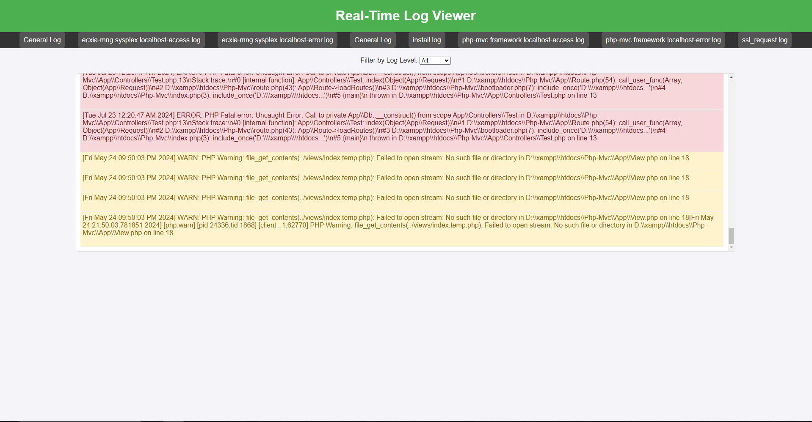

# Log viewer built with rust
This is a simple log viewer built with rust for me to understand core concepts within rust.

Features:
- filter by log level
- search
- multiple logs
- realtime log 
- file chunking
- web dashboard

## Rust environment
Host: x86_64-pc-windows-msvc

Toolchain: stable-x86_64-pc-windows-gnu
